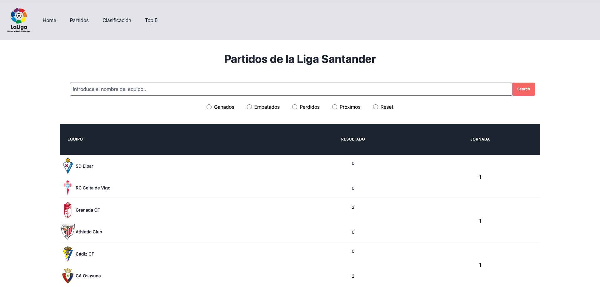
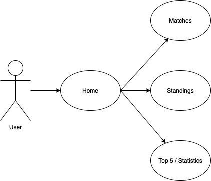
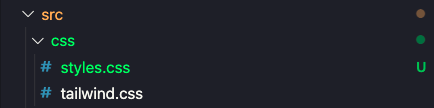

#  La Liga Santander App

## Functional Description
Hi!, This App offers updated info of the La Liga championship. Here are the main info users can look up:
- Matches:  Every match results starting from the first match day to the current ones
- Clasificacion: Current standings for each team on La Liga, includes:
    - Played games
    - Won games
    - Lost games
    - Draw games
    - Goals for
    - Goals against
    - Points
    - Last 5 days streak
- Top 5: Statistics for:
    - Teams with the best goal average
    - Teams received less goals when playing away

## User interaction
This is the main user journey:

    
## Technical description
### Common functions:
    - Loader: Creates a loader appending a div to the main body
    - LoaderAway: Deletes the prevously created Loader
    - In each js there's a fetch function to grab the data from the API

### estadisticasScript:
    - getFewerGoalsGame(): Accepts an array. Calculates the teams with less goals received playing away. Return an array
    - getAverageGoalsGame(): Accepts an array. Calculates the teams with more goals per game. Return an array
    - create AverageTable(): Accepts an array. Appends row ands cells to the Average Table.
    - createLessGoalsTable(): Accepts an array. Appends row and cells to the Less Goals Table

### stadingsScript:
    - createArray(): Accepts an array. Returns an object with all the data sorted
    - appendStandings(): Accepts an array. Appends the previously created array to the DOM

### matchesScript: 
    - filterArraySearch(): Accepts an array. Iterates over all the matches and returns an array of elements depending on the value of the search Form and radio buttons values
    - searchChecker(): validates the user has entered a value for the search form. If it does not an alert appears
    - radioChecker(): same but for all the radio buttons:
    - closeAlert(): Closes the alert in case it's been appended to the body
    - appendMatches(): Accepts an array. Appends the filtered array to the dom after cleaning the first shown matches table
    - searchData(); Accepts an array. Gets both the filterd Array and triggers the appendMatches function when the user clicks the Send Button on the form search

## Technologies

# Tailwind  implementation
Tailwind is a CSS framework, it can be used via a CDN os using a Node Package.
In this case the app uses npm to install the package and compile the used styles using a purge functionality

## How to compile
As a developer, it will be necessary to compile the styles every time you add or modify classes to the html or the js.

In order to do so, you'll first need to install all the dependencies for the project:

~~~
node npm install
~~~

Once the packages have been installed you should run the command to compile the CSS using:

~~~
node run build
~~~

Once run, you should see compiled the styles on the src>css folder

## Version

v.1.1: Matches, Standings and statistics added
(22/02/21)

v.1.0: Refactor of the code and added the Home interface to acces inner sections (23/02/21)

## To-Dos

- Add a Teams page to browse them.
- Link each team on each page (standing, matches, estadísticas) to each Team page
- Apply animations
